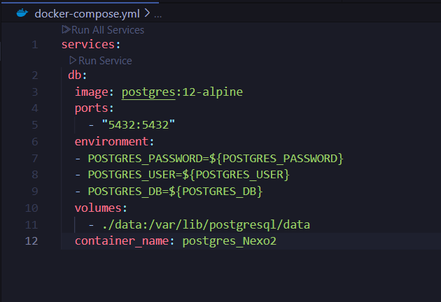

# Manual para la Configuración del Contenedor PostgreSQL – Proyecto Nexo2

Este manual describe cómo configurar y levantar un contenedor Docker para una base de datos PostgreSQL, específicamente diseñado para el sistema Nexo2. Se utiliza Docker Compose para definir el servicio. A continuación se explican los componentes necesarios para levantar el entorno de base de datos.

## 1. docker-compose.yml

Este archivo define el servicio necesario para levantar un contenedor de PostgreSQL. A continuación se presenta el contenido del archivo:


## 2. Descripción de la Configuración

**services:**
 **db:**  
- `image: postgres:12-alpine` – Imagen oficial de PostgreSQL 12 en variante ligera Alpine.    
- `ports: "5432:5432"` – Expone el puerto estándar de PostgreSQL.  
- `environment:`  
  - `POSTGRES_PASSWORD=${POSTGRES_PASSWORD}` – Contraseña del usuario principal (se lee desde variable de entorno).  
  - `POSTGRES_USER=${POSTGRES_USER}` – Nombre del usuario principal (se lee desde variable de entorno).  
  - `POSTGRES_DB=${POSTGRES_DB}` – Base de datos inicial creada al arrancar (se lee desde variable de entorno).  
- `volumes:`  
  - `./data:/var/lib/postgresql/data` – Carpeta local `./data` montada para persistir los datos.
  - `container_name: postgres_Nexo2` – Nombre personalizado del contenedor.

## 3. Requisitos Previos

Antes de iniciar el despliegue del contenedor, asegúrese de tener:  
- Docker instalado.  
- Docker Compose instalado.  
- Permisos de administrador o acceso sudo.

## 4. Pasos para la Configuración

**Paso 1:** Crear un directorio del proyecto  
```bash
mkdir Nexo2-db
cd Nexo2-db
```
**Paso 2:** Crear el archivo docker-compose.yml  
Pegue el contenido YAML mostrado arriba dentro del archivo `docker-compose.yml`.
```

**Paso 3:** Crear el archivo `.env` (ejemplo)  
```bash
POSTGRES_PASSWORD=camilo
POSTGRES_USER=haroldcamilo
POSTGRES_DB=nexo02
```

**Paso 4:** Levantar el contenedor  
```bash
docker compose up -d
```
El flag -d ejecuta los contenedores en segundo plano.

**Paso 5:** Verificar que el contenedor está en ejecución 
```bash
docker ps
```
Debe aparecer el contenedor postgres_Nexo2 ejecutándose y con el puerto 5432 expuesto.

## 5. Acceso a PostgreSQL

Puede conectarse al servidor PostgreSQL dentro del contenedor con el siguiente comando:
```bash
docker exec -it postgres_Nexo2 psql -U ${POSTGRES_USER} -d ${POSTGRES_DB}
```

## 6. Personalización Adicional (opcional)

- Para mayor seguridad y flexibilidad, se recomienda:
- Usar un archivo .env para gestionar credenciales sin exponerlas en el docker-compose.yml.
- Crear un Dockerfile si necesita extensiones o configuraciones adicionales.

## 7. Buenas Prácticas

- No usar contraseñas triviales en entornos de producción.
- Hacer backups periódicos de la carpeta ./data.
- Limitar el acceso al puerto 5432 solo a las redes necesarias.

## 8. Conclusión
Esta configuración ofrece una solución rápida y funcional para integrar una base de datos PostgreSQL al proyecto Nexo2. Su simplicidad lo hace ideal para entornos de desarrollo y pruebas.
