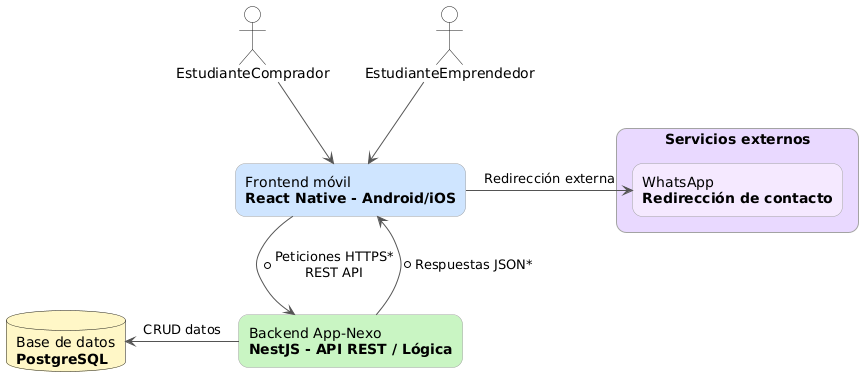
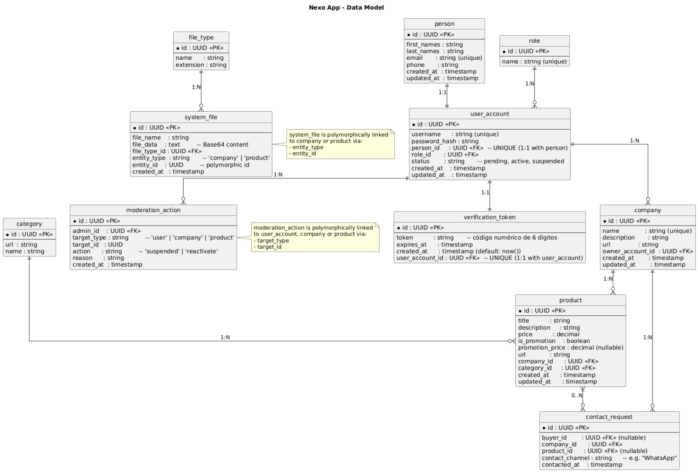

# Entregable principal — SRS (IEEE 830)

## 1.1 Introducción

### 1.1.1 Propósito
Especificar de manera clara, completa y verificable el comportamiento, interfaces, restricciones y criterios de aceptación de la aplicación móvil **“App-Nexo”**, un marketplace interno para estudiantes de la Universidad de Corhuila que desean publicar, reservar y entregar productos o servicios dentro del campus sin utilizar pasarela de pago.  

El SRS servirá como base única para el diseño, la implementación, las pruebas y la entrega de las **5 HU** del producto (historias de usuario) establecidos en el backlog del proyecto.

### 1.1.2 Alcance
La aplicación permite:  
- Registro/login con correo institucional.  
- Publicación de productos o servicios.  
- Navegación por catálogo con categorías.  
- Contacto con emprendedores vía WhatsApp.  
- Creación de promociones.  

No incluye:  
- Accciones del CRUD como actualizar y eliminar (empresas, productos o perfil de usuario)
- Pagos en línea.  
- Integración con redes sociales.  
- Métricas de ventas.  
- Gestión de entregas físicas.  

### 1.1.3 Definiciones, acrónimos y abreviaturas
- **RF:** Requisito Funcional.  
- **RNF:** Requisito No Funcional.  
- **HU:** Historia de Usuario.  
- **UC:** Caso de Uso.  
- **TC:** Test Case (Caso de Prueba).  
- **API REST:** Interfaz de comunicación cliente-servidor usando estilo REST.  
- **DB (Database):** Base de datos (PostgreSQL).  
- **AWS S3:** Servicio en la nube para almacenamiento de imágenes.  
- **WhatsApp:** Aplicación de mensajería usada para contacto comprador-emprendedor.  
- **React Native:** Framework multiplataforma para apps móviles.  
- **NestJS:** Framework backend basado en Node.js.  
- **Token de verificación:** Código único enviado al correo para validar registro o recuperación de contraseña.  
- **JWT (JSON Web Token):** Estándar de autenticación segura en formato JSON.  
- **@corhuila.edu.co:** Dominio institucional requerido para el registro.  

### 1.1.4 Referencias
- IEEE 830-1998 — *IEEE Recommended Practice for Software Requirements Specifications*.  
- [React Native — Documentación oficial](https://reactnative.dev/docs/getting-started).  
- [NestJS — Documentación oficial](https://docs.nestjs.com/).  
- [PostgreSQL — Documentación oficial](https://www.postgresql.org/docs/).  
- [AWS S3 — Documentación oficial](https://docs.aws.amazon.com/).  
- **Normativa colombiana:** Ley 1581 de 2012 y Decreto 1377 de 2013 (protección de datos personales).  

### 1.1.5 Visión general del documento
1. **Entregable principal — SRS (IEEE 830):**  
   - Propósito del sistema.  
   - Alcance funcional.  
   - Definiciones y referencias.  
   - Descripción general.  
   - Requerimientos funcionales (RF).  
   - Requerimientos no funcionales (RNF).  
   - Requerimientos de seguridad (RS).  
   - Requerimientos de interfaz (RI).  
   - Interfaces externas (UI, API, BD, hardware).  
   - Modelado de datos y consideraciones legales.  

2. **Historias de usuario (documentadas y trazables):**  
   - Identificador y rol del usuario.  
   - Narrativa (como [rol], quiero [acción], para [beneficio]).  
   - Criterios de aceptación en formato *Gherkin*.  
   - Relación con RF/RNF/RS.  
   - Priorización (*MoSCoW*).  
   - Observaciones técnicas o de validación.  

3. **Casos de uso (explicación + especificación + diagrama):**  
   - Plantilla de especificación (ID, actor, flujo, pre/postcondiciones, reglas de negocio, extensiones).  
   - Diagrama de casos de uso UML (*PlantUML*).  
   - Diagramas de actividad (opcional).  
   - Trazabilidad con RF y RS.  

---

## 1.2 Descripción general

### 1.2.1 Perspectiva del producto
- La solución inicia como una aplicación web desarrollada en **Ionic React**, conectada a un backend en **NestJS**.
- El backend gestiona la lógica de negocio, autenticación, validación de usuarios y administración de datos en **PostgreSQL**.  
- Las imágenes se almacenan como URLs en la base de datos y se sirven desde un servidor público; el frontend las renderiza mediante el atributo src, desde donde el navegador realiza una solicitud HTTP GET para obtener y mostrar los bytes del recurso. 
- En conjunto, la arquitectura asegura comunicación en tiempo real entre aplicación móvil y servidor, ofreciendo una experiencia fluida para estudiantes, emprendedores y administradores.  

### 1.2.2 Funciones del producto
El sistema provee las siguientes funciones principales, descritas a nivel alto:

- **Registro y Autenticación de Usuarios**  
  Permite a los estudiantes (compradores y emprendedores) registrarse mediante correo institucional @corhuila.edu.co, ingresando datos básicos (nombres, apellidos, teléfono, nombre de usuario, contraseña y rol). Incluye validación de identidad mediante token e inicio de sesión.

- **Publicación de Productos y Servicios**  
  Habilita a los emprendedores a crear, editar o eliminar publicaciones con título, descripción, precio, imagen y promociones opcionales.

- **Interacción y Comunicación**  
  Permite que compradores contacten directamente a los emprendedores a través de WhatsApp mediante enlaces generados en la app.

- **Gestión de Promociones**  
  Ofrece a los emprendedores la posibilidad de activar, desactivar y administrar promociones temporales asociadas a sus publicaciones.

- **Funciones opcionales a futuro**  
  Se consideran posibles integraciones de pagos en línea, estadísticas de desempeño y conexión con redes sociales, aunque no están contempladas en esta primera versión.

---

### 1.2.3 Características de los usuarios

- **Estudiantes emprendedores**  
  - *Perfil*: Jóvenes universitarios con negocios o proyectos de emprendimiento.  
  - *Habilidades*: Manejo básico/intermedio de herramientas digitales y redes sociales; experiencia en publicación de productos o servicios.

- **Estudiantes compradores**  
  - *Perfil*: Miembros de la comunidad universitaria interesados en adquirir productos o servicios dentro del campus.  
  - *Habilidades*: Alfabetización digital básica; uso frecuente de apps móviles y mensajería instantánea (WhatsApp).

---

### 1.2.4 Restricciones

- **Técnicas**  
  - Validación obligatoria de correos institucionales con dominio @corhuila.edu.co.  
  - Compatibilidad inicial garantizada con dispositivos móviles Android.  
  - Uso de infraestructura en la nube (AWS S3) y base de datos centralizada (PostgreSQL).

- **Legales**  
  - Cumplimiento de la Ley 1581 de 2012 y Decreto 1377 de 2013 (protección de datos personales en Colombia).  
  - Cifrado obligatorio para contraseñas y datos sensibles.  
  - Prohibición de contenido ilegal, ofensivo o en contra de las normas universitarias.

- **De negocio**  
  - Restricción de registro únicamente a estudiantes de la institución (mediante correo institucional).  
  - Aceptación de políticas de uso y convivencia universitaria.  
  - Tiempo de desarrollo limitado a un semestre académico.  
  - Integraciones de pago sujetas a futuros acuerdos institucionales y bancarios.

---

### 1.2.5 Supuestos y dependencias

- **Supuestos**  
  - Los usuarios cuentan con dispositivos móviles con acceso estable a internet.  
  - Los estudiantes poseen competencias digitales básicas para utilizar la app.  
  - El dominio @corhuila.edu.co seguirá vigente para todos los registros.  
  - La institución respalda oficialmente el uso de la aplicación.  
  - El tamaño máximo de las imágenes cargadas no superará los límites definidos (5 MB).

- **Dependencias**  
  - Disponibilidad de conectividad a internet para registro, navegación y notificaciones.  
  - Servicio de correo electrónico institucional para verificación de cuentas y recuperación de contraseñas.  
  - Integración con WhatsApp para comunicación entre compradores y emprendedores.  
  - Servicio en la nube (AWS S3) para almacenamiento de imágenes.  
  - Políticas de TI de la universidad para garantizar seguridad y soporte técnico.

### 1.3.2 Funciones del sistema (Requisitos Funcionales - RF)

| ID | Descripción | Prioridad | Criterio de aceptación |
|----|--------------|------------|------------------------|
| **RF-01** | El sistema debe permitir el registro de las personas con nombres, apellidos, correo institucional, teléfono, rol, nombre usuario y contraseña. | Alta | Dado un correo válido con dominio @corhuila.edu.co y contraseña ≥6, se crea la cuenta y se envía token. |
| **RF-02** | El sistema debe validar que el correo contenga el dominio @corhuila.edu.co. | Alta | Si el correo no contiene el dominio, el sistema rechaza el registro y muestra mensaje de error. |
| **RF-03** | El sistema debe enviar un token de verificación al correo institucional con vigencia de 1 minuto y permitir solicitar uno nuevo si expira. Luego, permitir activación mediante dicho token. | Alta | Se envía un token válido por 1 minuto; si expira o es inválido, puede reenviarse. Al validarlo, la cuenta se activa. |
| **RF-04** | El sistema debe permitir iniciar sesión con correo institucional o usuario y contraseña previamente registrados. | Alta | Dadas credenciales válidas, el sistema permite acceso; si no, muestra error. |
| **RF-05** | El emprendedor debe poder crear una empresa con nombre, descripción e imagen opcional. | Alta | Al completar el formulario y guardar, se registra la empresa y queda disponible para crear publicaciones. |
| **RF-06** | El emprendedor debe poder crear publicaciones de productos con título, descripción, precio, promoción (opcional) y foto. | Alta | Al completar el formulario y subir imagen válida, la publicación aparece en el catálogo. |

---

### 1.3.3 Rendimiento (Requisitos No Funcionales - Performance)

- **RNF-P01**: El tiempo de arranque de la aplicación en dispositivos de gama media no debe superar los **3 segundos (p95)**.  
- **RNF-P02**: El tiempo de respuesta para mostrar el catálogo de productos/servicios no debe superar los **800 ms** en condiciones de red 4G o WiFi estable.  
- **RNF-P03**: El tiempo de carga de imágenes almacenadas en AWS S3 no debe superar los **1.5 segundos (p95)** por recurso individual.  
- **RNF-P04**: El flujo de registro y autenticación (incluyendo verificación de token por correo) debe completarse en un máximo de **5 segundos**.  

---

### 1.3.4 Lógica de datos / Base de datos

#### Módulo: Security  
Gestión de información básica de las personas y sus cuentas de usuario.

**person**  
- id (UUID, PK)  
- first_names (string)  
- last_names (string)  
- email (string, unique)  
- phone (string)  
- created_at (timestamp)  
- updated_at (timestamp)  

**user_account**  
- id (UUID, PK)  
- username (string, unique)  
- password_hash (string)  
- person_id (UUID, FK → person)  
- role_id (UUID, FK → role)  
- status (string: pending, active, suspended)  
- created_at (timestamp)  
- updated_at (timestamp)  

**role**  
- id (UUID, PK)  
- name (string, unique)  

Roles precargados (INSERT inicial):  
- emprendedor  

**verification_token**  
- id (UUID, PK)  
- token (string) ← código numérico de 6 dígitos  
- expires_at (timestamp)  
- created_at (timestamp, default: now())  
- user_account_id (UUID, unique, FK → user_account)  

---

#### Módulo: Company and Product  
Núcleo de la aplicación para gestionar empresas y productos.

**company**  
- id (UUID, PK)  
- name (string, unique)  
- description (string)  
- url (string) ← imagen  
- owner_account_id (UUID, FK → user_account)  
- created_at (timestamp)  
- updated_at (timestamp)  

**category**  
- id (UUID, PK)  
- url (string)  
- name (string)  

**product**  
- id (UUID, PK)  
- title (string)  
- description (string)  
- price (decimal)  
- is_promotion (boolean)  
- promotion_price (decimal, NULLABLE)  
- url (string)  
- company_id (UUID, FK → company)  
- category_id (UUID, FK → category)  
- created_at (timestamp)  
- updated_at (timestamp)  

> Imágenes de empresas y productos se gestionan en `system_file` usando `entity_type` y `entity_id`.

---

#### Módulo: Contact  
Gestión de conexión entre compradores y emprendedores vía WhatsApp.

**contact_request**  
- id (UUID, PK)  
- buyer_id (UUID, FK → user_account, NULLABLE)  
- company_id (UUID, FK → company)  
- product_id (UUID, FK → product, NULLABLE)  
- contact_channel (string) ← Ej: "WhatsApp"  
- contacted_at (timestamp)  

---

#### Módulo: System Files  
Gestión de archivos (imágenes de productos, empresas).

**file_type**  
- id (UUID, PK)  
- name (string) — Ejemplo: Imagen PNG, Imagen JPG  
- extension (string) — Ejemplo: .png, .jpg  

**system_file**  
- id (UUID, PK)  
- file_name (string) — Nombre original del archivo  
- file_data (text) — Contenido en *Base64*  
- file_type_id (UUID, FK → file_type)  
- entity_type (string) ← company, product  
- entity_id (UUID) — Relación dinámica con la entidad  
- created_at (timestamp)  

---

#### Módulo: Moderation  
Acciones administrativas de control y calidad.

**moderation_action**  
- id (UUID, PK)  
- admin_id (UUID, FK → user_account)  
- target_type (string) ← user, company, product  
- target_id (UUID)  
- action (string) ← suspended, reactivate  
- reason (string)  
- created_at (timestamp)  

---

### Relaciones clave
- person **1:1** user_account  
- user_account **1:N** company  
- company **1:N** product  
- system_file **1:N** file_type (cada archivo tiene un tipo definido)  
- system_file se vincula dinámicamente a company o product vía entity_type y entity_id  
- contact_request apunta a company y opcionalmente a product y buyer  
- Cada user_account puede tener solo un verification_token activo (**1:1**).

## Flujo del Usuario Emprendedor

### 1. Registro y Autenticación
- **Registro:** El usuario crea su cuenta ingresando su `first_names`, `last_names`, `email`, `phone`, `name` (role), `username` y `password_hash`.  
  El sistema verifica el email (@corhuila.edu.co) y, si es válido, el `status` de la cuenta se establece en `pending`.  
  Si no es válido, se muestra en la pantalla un mensaje de error.
- **Activación:** Al verificar el correo, el `status` cambia a `active`.
- **Inicio de Sesión:** Inicia sesión utilizando su `username` y `password`.

### 2. Creación de la Empresa
- El emprendedor inicia sesión. Si su cuenta (`user_account`) no está vinculada a una `company`, se le presenta la opción de crear una.
- Llena un formulario con los siguientes campos: `name`, `description` y `url`.  
  El sistema asocia esta nueva `company` con el `id` de su `user_account` (`owner_account_id`).
- Las imágenes (logo) se gestionan de forma flexible, subiendo la `url` de un archivo que se vinculará a la entidad `company` (`entity_type: 'company'`) en la tabla `system_file`.

### 3. Gestión de Productos
- Desde su `company`, el emprendedor puede agregar un `product`.
- Llena un formulario con: `title`, `description`, `price`, `url` (foto) y `promotion_price` (opcional).
- Las imágenes de los productos se guardan en `system_file` con `entity_type: 'product'`.

### 4. Gestión de Promociones
- Desde un `product` específico, puede habilitar una promoción configurando el campo `is_promotion` a `true` y estableciendo el `promotion_price`.

### 5. Restricciones
- No puede crear categorías.
- Aunque la relación `user_account 1:N company` permite que un usuario pueda tener varias empresas, en esta versión se restringe a **una sola empresa por usuario** como regla de negocio.

---

### 1.3.5 Restricciones de diseño — plataformas, SDKs, guías UI

#### Plataformas soportadas
- Inicialmente: **Ionic + React** para soportar Android/iOS.
- Backend en **NestJS (Node.js)** con **PostgreSQL**.

#### Infraestructura
- Imágenes alojadas en un servidor público accesible vía HTTP.
- Base de datos centralizada en **AWS RDS** (PostgreSQL).

#### SDKs y librerías
- Librerías oficiales de **AWS SDK** para manejo de imágenes.  
- **React Navigation** para navegación móvil.  
- Validación de correos y autenticación con librerías estándar (**JWT**).

#### Guías de UI/UX
- Interfaz siguiendo **Material Design** (Android).  
- Formularios y botones accesibles (contraste, tamaño mínimo de toque ≥ 44px).

---

### 1.3.6 Atributos del sistema (RNF)

- **Seguridad:** credenciales cifradas, autenticación con correo institucional, control de roles (admin/emprendedor/comprador).  
- **Disponibilidad:** uptime ≥ 99%, tolerancia a fallos básicos.  
- **Mantenibilidad:** arquitectura modular en NestJS, documentación de API, separación de controladores/servicios.  
- **Portabilidad:** despliegue en **Docker**, compatible con distintos proveedores de nube.  
- **Accesibilidad:** interfaz intuitiva y responsive, soporte en móviles y navegadores modernos.  
- **Base:** idioma inicial español (es-CO).

---

### 1.3.7 Requisitos de internacionalización/localización

- **Formato de datos:** fecha (DD/MM/YYYY), moneda (COP, $), números.  
- **Internacionalización futura:** preparado para varios idiomas con `i18n`.  
- **Compatibilidad de caracteres:** soporte completo para **UTF-8**.

---

### 1.3.8 Requisitos legales y de privacidad

- Cumplimiento con la **Ley 1581 de 2012** y el **Decreto 1377 de 2013** (Colombia).  
- Datos sensibles (correo, teléfono, contraseña, empresa) cifrados y transmitidos por **HTTPS**.  

#### Consentimiento informado
- Los usuarios deben aceptar explícitamente la política de privacidad antes de registrarse.  
- Imágenes y publicaciones se usan solo dentro de la plataforma.

#### Uso legal
- Solo estudiantes de **Corhuila** con correo institucional válido pueden registrarse.  
- Prohibido contenido ilegal, ofensivo o discriminatorio.  
- El admin puede eliminar publicaciones, empresas o usuarios que incumplan normas.

#### Seguridad y privacidad en comunicaciones
- Comunicación app-backend vía **HTTPS**.  
- Integraciones externas (WhatsApp) no almacenan datos adicionales.

#### Almacenamiento y transferencia de datos
- Imágenes en **AWS S3** con URLs firmadas.

---

### 1.4 Apéndices
[Diseño en Figma](https://www.figma.com/design/nbyajVF3jNafcHBNPk0RiM/Sin-t%C3%ADtulo?node-id=0-1&t=6oLvp91VK13hoVMe-1)

---

**Fecha:** 14 de noviembre del 2025  
**Versión:** #5 
**Responsables:**  
- Danay Mariana Pereira Ospina  
- Harold Camilo Barrera Giraldo

